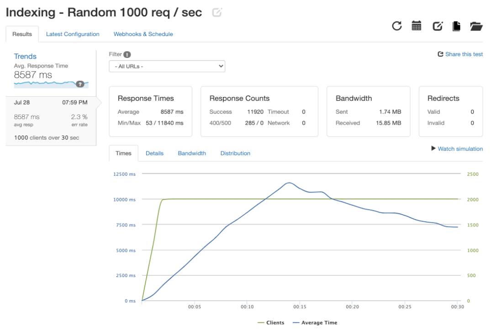
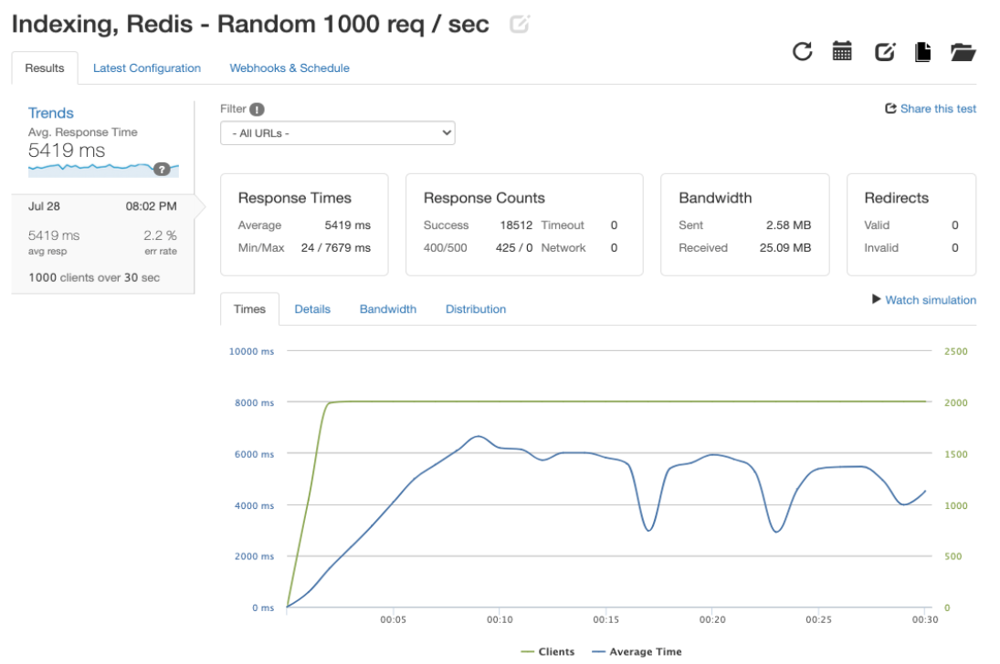
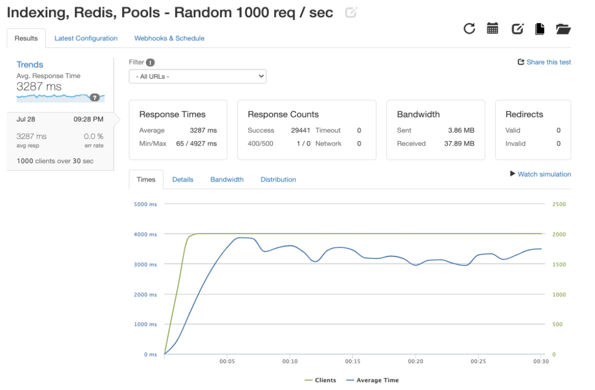
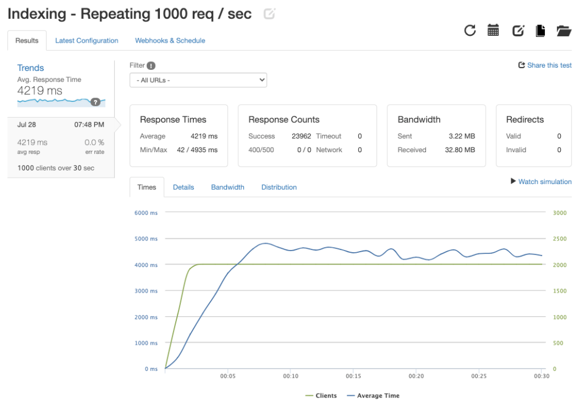
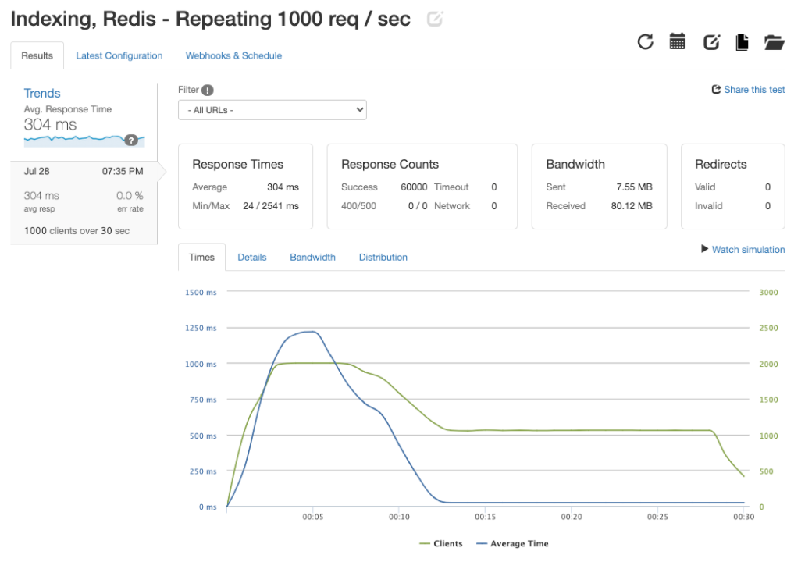
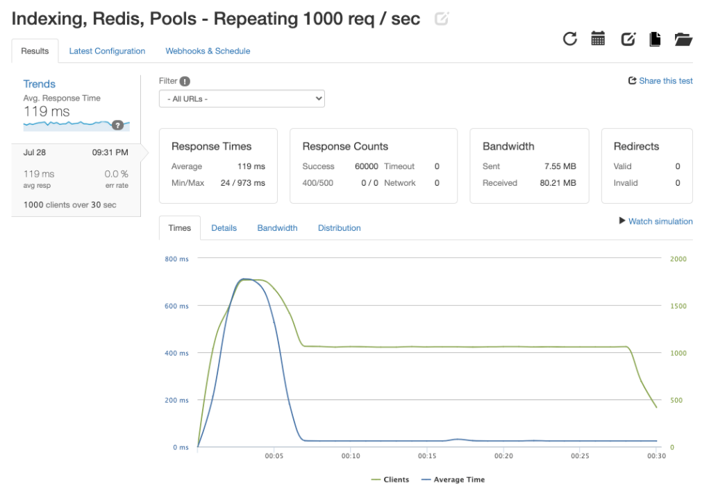

# Greenfield Reviews API Service
The goal of this project was to build a scalable RESTful API service for a retail web-portal and optimize to handle web-scale traffic. An ETL process was implemented to migrate legacy datasets of more than 20M+ records into a Postgres database. The service was incrementally optimized through database indexing, connection pooling, and Redis caching to handle a throughput of 60k client requests in 30 sec (2k per sec) with an average response time of 119ms (97.2% increase in avg. response time compared to just indexing). The server and Postgres database was containerized using Docker and deployed on 2 seperate AWS EC2 intances.

---

## Table of Contents
1. [Installing Dependencies](#Installing-Dependencies)
2. [Tech Stack](#Tech-Stack)
3. [Routes](#Routes)
4. [Load Testing](#Load-Testing)

---

## Installing-Dependencies

### Navigate to the root directory and run the following in your terminal:

>*Install dependencies*
```
npm install
```
>*Start the server*
```
npm start
```
Open `http://localhost:3000`

---

## Tech-Stack
- [Node.js](https://nodejs.org)
- [Express](http://expressjs.com/)
- [Postgres](https://www.postgresql.org/)
- [Redis](https://redis.io/)
- [Docker](https://www.docker.com/)

---

## Routes

| Request Type | Endpoint                    | Returns                                                                    | Status |
|--------------|-----------------------------|----------------------------------------------------------------------------|:--------:|
| GET          | /reviews/:product_id/list   | A list of reviews for a particular product, excluding any reported reviews | 200    |
| GET          | /reviews/:product_id/meta   | Review metadata for a given product                                        | 200    |
| POST         | /reviews/:product_id        | Nothing is returned - adds a review for the given product                  | 201    |
| PUT          | /reviews/helpful/:review_id | Nothing is returned - updates a review to show it was found helpful        | 204    |
| Put          | /reviews/report/:review_id  | Nothing is returned - updates a review to show it was reported             | 204    |

---

## Load-Testing

### Test Group 1 - Requests on random IDs
#### *Scenario*
>Surge in traffic on the website, no specific points of interest

#### *Test Type*
>2000 client requests made each second for 30 seconds

#### *Queries*
>GET -- /reviews/%{*:1-100000}/list

>GET -- /reviews/%{*:1-100000}/meta

<br>

#### *Results*
| Optimization Type      | Avg. Response Time  | Successful Response Counts |
|------------------------|--------------------:|---------------------------:|
| Indexing               |             8587 ms |              11920 / 60000 |
| Indexing, Redis        |     5419 ms (36.9%) |               18512 / 60000 |
| Indexing, Redis, Pools |     3287 ms (61.8%) |               29441 / 60000 |

<br>

#### *Detailed Loader.io results:*

<details>
<summary>Indexing</summary>
<br>



</details>

<details>
<summary>Indexing, Redis Caching</summary>
<br>



</details>

<details>
<summary>Indexing, Redis Caching, Connection Pooling</summary>

<br>



</details>

<br>

### Test Group 2 - Requests on repeating IDs
#### *Scenario*
>Surge in traffic to specific points of interest (news event, influencer, etc.)

#### *Test Type*
>2000 client requests made each second for 30 seconds

#### *Queries*
>GET /reviews/%{*:100000-100010}/list

>GET /reviews/%{*:100000-100010}/meta

<br>

#### *Results*
| Optimization Type      | Avg. Response Time  | Successful Response Counts |
|------------------------|--------------------:|---------------------------:|
| Indexing               |             4219 ms |              23962 / 60000 |
| Indexing, Redis        |      304 ms (92.8%) |               60000 / 60000 |
| Indexing, Redis, Pools |      119 ms (97.2%) |               60000 / 60000 |

<br>

#### *Detailed Loader.io results:*

<details>
<summary>Indexing</summary>
<br>



</details>

<details>
<summary>Indexing, Redis Caching</summary>
<br>



</details>

<details>
<summary>Indexing, Redis Caching, Connection Pooling</summary>

<br>



</details>

<br>